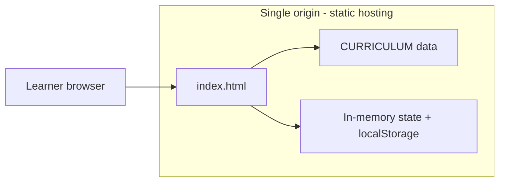
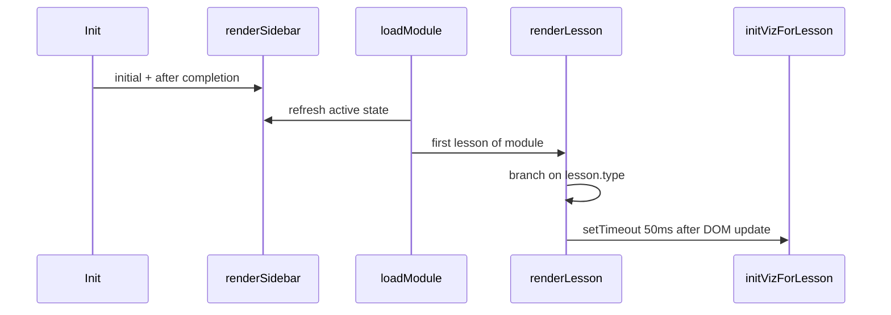

# System design — Beyond Vibe Code

This document describes how the static BVC application is structured: data model, UI pipeline, interactive subsystems, and tradeoffs.

## High-level architecture



There is **no server application**. GitHub Pages (or any static host) serves `index.html`. All “business logic” runs in the user’s browser.

## UI shell

The page is a fixed layout:

- **Sidebar** (`#track-list`): collapsible **tracks**; each expanded track lists **modules** with numeric IDs and completion styling.
- **Main** (`#main-content`): welcome screen, or the active lesson (top bar, body, footer with lesson progress).

Global CSS uses CSS variables for theming (dark background, accent color). Lesson bodies inject class-based components (`.prose`, `.code-block`, `.viz-container`, `.fitb-container`, `.quiz-container`, `.editor-container`).

## Data model

### Curriculum graph

`CURRICULUM` is a **JavaScript array** of **tracks**:

```text
CURRICULUM[i] = { track: string, modules: Module[] }
```

Each **module** includes:

| Field | Purpose |
|-------|---------|
| `id` | Stable numeric id; used for ordering, sidebar labels, and `localStorage` completion |
| `title` | Display name |
| `pain` | Optional short “pain point” copy for narrative lessons |
| `lessons` | Ordered array of lesson objects |

Each **lesson** has a `type` that selects the renderer:

| `type` | Main payload | Render path |
|--------|----------------|-------------|
| `lesson` | `content` (HTML string) | Injected inside `.lesson-content`; may contain visualization containers |
| `fitb` | `content` (optional intro) + `fitb` object | `renderFITB()` replaces `[BLANKn]` tokens with `<input>` elements |
| `quiz` | `questions[]` | `renderQuiz()` builds one `.quiz-container` per question |
| `editor` | `instructions`, `starterCode` | `renderEditor()` — textarea + Run / Reset |

Quizzes store the correct option as a **zero-based index** into `opts`. Explanations appear after an answer is chosen.

### Ordering and completion

- **Module order** is the order of modules within each track, and tracks appear in array order in `CURRICULUM`.
- **“Complete module”** appends the current module’s `id` to a `Set` backed by **`localStorage`** key `bvc_completed`, then navigates to the **next module** in global linear order (nested loops over tracks). The last module shows a completion message instead.

### Ephemeral UI state

- `currentModule`, `currentLessonIdx` — navigation within a module.
- `openTracks` — which track headers are expanded in the sidebar (not persisted).

## Rendering pipeline



1. **`renderSidebar()`** rebuilds the sidebar from `CURRICULUM`, `openTracks`, `currentModule`, and `completedModules`. Progress text shows `completedCount / 35` (total modules is fixed in the UI).
2. **`loadModule(mod)`** sets `currentModule`, resets `currentLessonIdx` to 0, refreshes sidebar, calls **`renderLesson()`**.
3. **`renderLesson()`** composes:
   - Top bar: breadcrumb, Back / Next or Complete.
   - Body: from `lesson.type` (HTML string or helper).
   - Footer: lesson index and progress bar.
4. **`initVizForLesson(lesson)`** runs after a short timeout so DOM nodes from `lesson.content` exist. It does **not** use generic selectors; it **dispatches on `lesson.title` substrings** (e.g. “Binary”, “Stack vs Heap”, “Big O”, “HTTP, DNS”). Adding a new viz requires consistent titling or refactoring this dispatch.

## Interactive subsystems

### Fill-in-the-blank (`fitb`)

Blanks are placeholders in `fitb.code` like `[BLANK1]`. Each entry in `fitb.blanks` maps an `id`, `answer`, and replacement with a case-insensitive string compare on check.

### Quiz

Clicking an option disables further input for that question, marks correct/wrong, reveals the explanation panel, and highlights the correct option.

### Code editor (`editor`)

- **Run** reads the textarea and evaluates with `new Function('console', 'require', code)` where:
  - `console` is a **fake** object that captures `log` / `warn` / `error` into an output div.
  - `require` is a stub returning `{}` so lessons can show CommonJS-style snippets without crashing.
- This is **not** Node.js: no real `fs`, `net`, or npm modules. It is suitable for small algorithm exercises only.

### Visualizations

Implemented as plain DOM manipulation functions that target **ids** embedded in lesson HTML (e.g. `#binary-slider`, `#stack-frames`, `#bubble-bars`). Examples include:

- Binary representation slider
- Stack/heap step-through (`MEM_STEPS`)
- Array vs hash lookup animation (`runDSDemo`)
- Bubble vs merge sort bar charts with operation counts
- Big-O comparison bars for a chosen `n`
- HTTP/TLS step list (`HTTP_STEPS_DATA`)
- Simulated test runner output (`TEST_CASES`)

These are **tightly coupled** to specific lessons; reusing a viz in another lesson means duplicating markup ids or generalizing the init functions.

## Security and privacy notes

- **No accounts**: nothing is sent to a server; progress stays in `localStorage` on that browser/origin.
- **User-supplied code** in editor lessons runs in the page context via `new Function`. Only trusted authors should edit `CURRICULUM`. End users running their own code in the exercise box is intentional but has the usual “run arbitrary JS in this origin” implications (same as browser devtools on that page).

## Scalability and maintainability

**Strengths**

- Zero deploy complexity; easy to fork and host.
- One file to grep for content and behavior.

**Constraints**

- Large `index.html` is harder to diff and review than split modules (no bundler enforced).
- Visualization routing by **title substring** is brittle; consider module/lesson ids or explicit `viz: 'binary' | 'memory' | …` fields if the curriculum grows.
- The `35` in the progress label is **hardcoded**; it should match the actual module count in `CURRICULUM`.

## Extension points

- **New lesson types**: add a branch in `renderLesson()`, a renderer function, and any CSS for new components.
- **Persistence**: replace or augment `localStorage` with export/import JSON, or a backend later (would require a separate project).
- **Splitting the codebase**: extract `CURRICULUM` to JSON loaded via `fetch`, or use ES modules with a small bundler—out of scope for the current single-file design.
